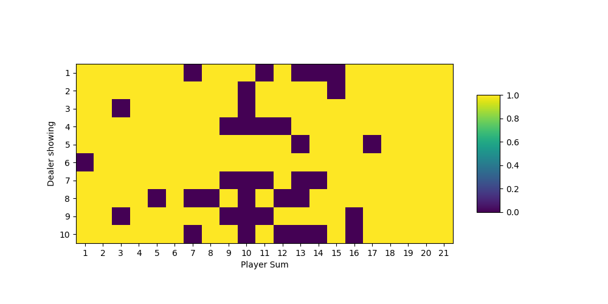

# Reinforcement Learning Baselines

This is my collection of reinforcement learning baseline applied on a wide variety of OpenAI gym environments.

## Usage

Running the following command to run all implemented RL agents on the Easy21 game.

'''
python3 easy21_agents.py
'''

After training the agents for multiple episodes the results are presented in two forms:

* A matrix representing the policy of the agent where purple or 0 is HIT and yellow or 1 is STICK
* A 3D plot representing the value function of the agent for every state

## Monte Carlo Agent Evaluation

The Monte Carlo Agent with evaluation uses a fixed policy while evaluating the value function for each state.

### Policy

The player sum means the state of the agent. The fixed policy is the following:
* for every sum under 17 for the player it will HIT, so draw a new card
* for every sum of 17 and over it will STICK, so won't receive further cards

### Value function

The value function reflects this fixed policy, the state values are consistent across the different dealer sums, since this does not effect the decisions of the agent. Obviously the low player sums represent a low value, since the agents can not win with these numbers only if the dealer goes bust. The higher sums have higher values, since these will probably beat the dealer. However there is a valley between 11 and 16. This is the region where the agent will still draw but could go bust with higher value cards.

## Monte Carlo Agent Control

The Monte Carlo Agent with control is simoutaneously updating the value function of every state and then acts upon those values greedily.

### Policy

This policy if currently false.

### Value function

The value function seems to be allright. The higher the dealer is showing the less the agent thinks it will win. And there is still a valley around 16 there, where it is risky to HIT.

## Types of environments
There are two types of environments a RL agent can work in:
* Fully observable environment
* Partially observable environments

## Components of RL Agent
* Policy : agents behavious function
* Value function : how good is each state or action
* Model : agent's representation of the environment (predicts the next state and reward)

## Categorizing RL agents
* Brute force
    * Sample every policy
    * Choose best return
* Value based
    * No policy
    * Value function
* Policy based
    * Policy
    * No value function
* Actor Critic
    * Policy
    * Value function
* Model Free
    * Policy or Value function
    * No model
* Model based
    * Policy or Value function
    * Model

## Further class mterial from David Silver's RL course
* Model-free prediction
    * Monte-Carlo learning
    * Temporal-Difference learning
    * TD-lambda
* Model-free control
    * On-policy Monte Carlo Control
    * On-policy Temporal difference learning
    * Off-policy learning
* Value function approximation
    * Incremental methods
    * Batch methods
* Policy gradient
    * Finite difference Policy gradient
    * Monte-Carlo policy gradient
    * Actor-Critic policy gradient

## Easy21 submission
* Implementation of Easy21
* Monte-Carlo Control in Easy21
* TD Learning in Easy21
* Linear Function Approximation in Easy21

## Easy21 documentation

### RL cheat sheet
* Reward
    * Variable name: R_t
    * Scalar feedback signal
    * Indicates how well the agent is doing at step t
    * Agents job is to maximize the cumulative reward
    * Reward Hypothesis: every goal can by described by the maximisation of expected cumulative rewards
* Agent
    * Variable name: agent
    * Executes action A_t
    * Reveives observation O_t
    * Receives scalar reward R_t
* Environment
    * Variabel name: env
    * Receives action A_t
    * Emits observation O_t+1
    * Emits scalar reward R_t+1
* History
    * Variable name: H_t
    * Sequence of Obsevations, Rewards and Actions
    * H_t = O_1, R_1, A_1, ... , A_t-1, O_t, R_t
* State
    * Variable name: S_t
    * The information used to determine what happens next
    * Function of the history
    * S_t = f(H_t)
    * A Markov state contains all useful information from the history
    * "The future is independent of the past given the present"
* Policy
    * Variable name: policy
    * The agent's behaviour, a map from the state space to the environment space
    * Can be deterministic or stochastic
    * Deterministic policy:
        * action = policy(state)
    * Stochastic policy:
        * policy(action|state) = P[A_t = a|S_t = s]
* Value function
    * Variable name: V
    * Prediction of future reward
    * Expected value of sum of future discounted rewards
* Model
    * Varibale name: P, R
    * Predicts what the environment will do next
    * P predicts the next state
    * P is a state transition matrix
    * R predicts the next reward
* Learning and planning
    * Reinforcement learning
        * Environment is unknown
        * Agent interacts with environment
        * Agent improves its policy
    * Planning
        * A model of the environment is known
        * Agent improves policy by simulation
* Exploration vs Exploitation
    * Exploration finds more information about the environment
    * Exploitation exploits known information about the environment for maximum reward
* Prediction and control
    * Prediction evaluates the future
    * Control optimises the future
* Markov Process (Markov chain)
    * A memoryless random process, a sequence of random states with Markov property
* Markov Reward Process
    * A Markov process with reward values and a discount factor
    * R: reward function of state
    * gamma: discount factor [0, 1]
* Return
    * Variable name: G
    * Total discounted reward from timestep t
    * G_t = R_t+1 + gamma * R_t+2 + ...
* Discount
    * Variable name: gamma
    * 0 discount is short sighted
    * 1 discount is far sighted
    * Mathematically convenient, avoids infinite returns
    * Uncertainty about the future
    * Preference for immediate reward (mortality)
* Value function
    * State-value function
        * Expected return starting from state s, and then following given policy
    * Action-value function
        * Expected return
starting from state s, taking action a, and then following given policy
    * Bellman equation is applicable to both state and action value functions
* Bellman equation for MRPs
    * The value function can be decomposed into two parts
        * Immediate reward (R_t+1)
        * Discounted value of succesor state (gamma * V(S_t+1))
    * Can be solved as a linear equation using the state transition matrix
    * Only works for small number of states (O(n^3) computational complexity)
* Markov Decision process
    * Markov Reward Process with decisions
    * A is a finite set of actions
* Policy
    * Variable name: policy
    * Distribution over actions given states
    * Fully defines the bahviour of the agent
    * Policies are stationary (after training)
* Optimal value function
    * Optimal state-value function is the maximum value function over all policies
        * V*(s) = max(V(s))
    * Optimal action-value function is the maximum action-value function over all policies
        * Q*(s,a) = max(Q(s,a))
    * The optimal value function specifies the best possible performance in the MDP
    * The MDP is solved when the optimal value function is known
* Optimal Policy
    * For any MDP there is an optimal policy that is better or equal to all other policies
    * All optimal policies have the optimal value function
    * Apll optimal policies have the optimal action-value function
* Solving the Bellman Optimality Equation
    * Non-linear, no closed solution
    * Many iterative solutions
        * Value Iteration
        * Policy Iteration
        * Q-learning
        * Sarsa
* Extensions to MDPs
    * Infinite and continuous MDPs
    * Paritally observable MDPs
    * Undiscounted, average reward MDPs
* Planning by dynamic programming
    * Markov Deciosion Precesses satisfy DP properties
    * Prediction: outputs value function
    * Control: Outputs optimal value function and policy
* Iterative Policy Evaluation
    * Iterative application of Bellman expectation backup
    * Every iteration update V_k+1(s) from V_k(s') where s' is successor of s
* Improve a policy (Policy iteration)
    * Evaluate policy, giving a new value-function
    * Improve policy by acting greedily with respect to the value function
    * Update policy every iteration, equivalent to value iteration
* Value iteration
    * ...

